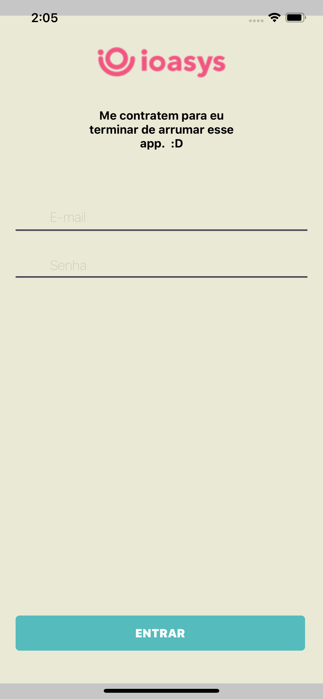
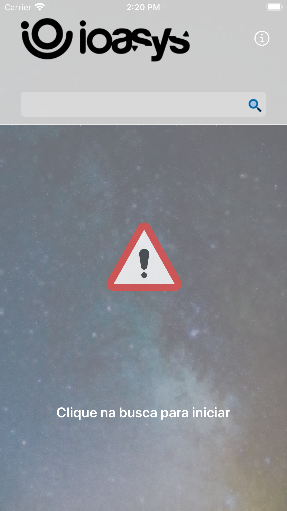
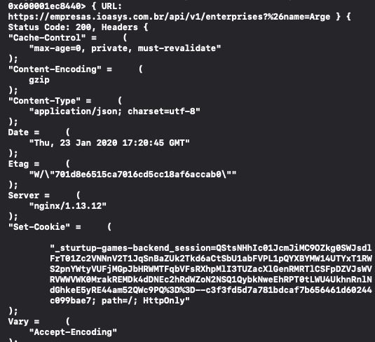
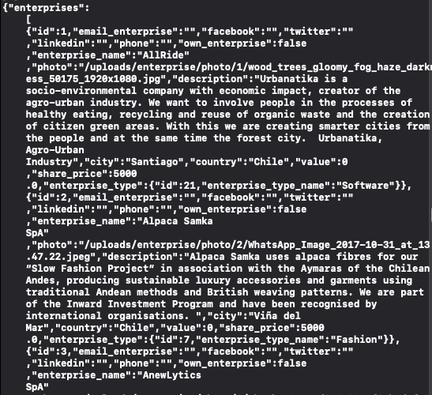
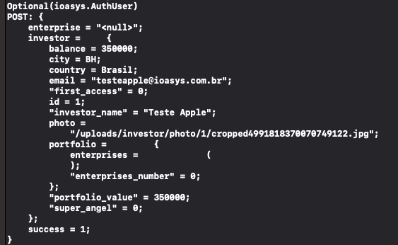

# Ioasys

 

## Architecture

I opted to use **MVVM** because it is easy to separate responsibilities and easy to create tests.

### Coordinator pattern
To navigate between controllers using the coordinating layer without having any viewControllers references in others. While moving the navigation logic to the coordinator. Which will help reduce the huge effect of the display controller.

### Strategy Pattern
Use the strategy pattern. Define a set of strategies in your removal classes and then provide these classes via **dependency injection**. For example:

    func registerServices() {
        self.container.register(EnterpriseService.self) { _ in
            let provider = MoyaProvider<FactsRouter>(plugins: self.getDefaultPlugins())
            return EnterpriseServiceRouterProvider(provider: provider)
        }
        
        self.container.register(EnterpriseStorage.self) { resolver in
            EnterpriseStorageImpl(
                service: resolver.resolve(EnterpriseService.self)!
            )
        }
    }
    
### Libraries

* **Swinject**: For dependency injection;
* **Moya**: For services;
* **Lottie**: For animations;
* **KIF**: UI Tests;

## Auto-Retry
    retry(
        
            .exponentialDelayed(maxCount: maxRetry, initial: initialRetry, multiplier: multiplierRetry), shouldRetry: {error in
                guard let moyaError = error as? MoyaError else {
                    return false
                }
                if case let .underlying(error, _) = moyaError {
                    let error = (error as NSError)
                 
                    if error.domain == NSURLErrorDomain || 500...599 ~= error.code {
            
                        return true
                    }
                }
                return false
    })
## Services

 

